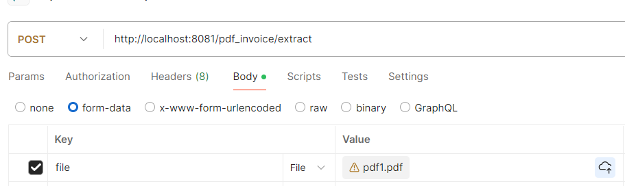

### 电子发票识别
### 简介
普通电子发票识别，可识别大部分电子普票，电子专票，全电发票，文件类型支持pdf和ofd格式。

### web接口调用形式

### pdf解析结果测试

/test_pdf_ofd/pdf1.pdf

    {
        "msgCode": 200,
        "msg": "返回成功！",
        "code": "012001800211",
        "number": "23326471",
        "date": "2018年09月21日",
        "checksum": "16707184549009707698",
        "totalAmount": 756.63,
        "totalAmountString": "柒佰伍拾陆元陆角叁分",
        "taxAmount": 22.04,
        "amount": 734.59,
        "buyerName": "聚光科技（杭州）股份有限公司",
        "buyerCode": "91330000734500338C",
        "buyerAddress": "杭州市滨江区滨安路760号0571-85012188",
        "buyerAccount": "中行滨江支行385758326851",
        "sellerName": "滴滴出行科技有限公司",
        "sellerCode": "911201163409833307",
        "sellerAddress": "天津经济技术开发区南港工业区综合服务区办公楼C座103室12单元022-59002850",
        "sellerAccount": "招商银行股份有限公司天津自由贸易试验区分行122905939910401",
        "type": "普通发票",
        "detailList": [
            {
                "name": "*运输服务*客运服务费 无",
                "model": null,
                "unit": "次",
                "count": 1,
                "price": 734.59,
                "amount": 734.59,
                "taxRate": 0.03,
                "taxAmount": 22.04
            }
        ]
    }

### ofd解析结果测试

/test_pdf_ofd/ofd1.pdf

    {
        "msgCode": 200,
        "msg": "返回成功！",
        "code": null,
        "number": "24122000000021651285",
        "date": "2024年04月22日",
        "checksum": null,
        "totalAmount": 14464.11,
        "totalAmountString": "壹万肆仟肆佰陆拾肆圆壹角壹分",
        "taxAmount": 1664.01,
        "amount": 12800.10,
        "buyerName": "天津中通鼎兴钢管有限公司",
        "buyerCode": "91120112578348556H",
        "buyerAddress": null,
        "buyerAccount": null,
        "sellerName": "天津市合盛钢管有限公司",
        "sellerCode": "91120223727492229X",
        "sellerAddress": null,
        "sellerAccount": null,
        "type": "增值税专用发票",
        "detailList": [
            {
                "name": "*黑色金属冶炼压延品*直缝焊管",
                "model": "60*3.5",
                "unit": "吨",
                "count": 3.2,
                "price": 3565.48672566372,
                "amount": 11409.56,
                "taxRate": 0.13,
                "taxAmount": 1483.24
            },
            {
                "name": "*黑色金属冶炼压延品*直缝焊管",
                "model": "60*3.75",
                "unit": "吨",
                "count": 0.23,
                "price": 3565.48672566372,
                "amount": 820.06,
                "taxRate": 0.13,
                "taxAmount": 106.61
            },
            {
                "name": "*黑色金属冶炼压延品*直缝焊管",
                "model": "60*4.75",
                "unit": "吨",
                "count": 0.16,
                "price": 3565.48672566372,
                "amount": 570.48,
                "taxRate": 0.13,
                "taxAmount": 74.16
            }
        ]
    }

### 说明
改进如下：
- 1.将ofd的转为pdf再进行解析，避免了ofd解析错误。
- 2.优化了pdf解析过程的若干错误。
- 3.对pdf解析结果的矫正以及去除不必要的解析信息。

### 联系我
- https://jiangnanboy.github.io
- 2229029156@qq.com

### 参考
- https://github.com/invoice-x/invoice2data
- https://github.com/renoyuan/easyofd
- https://github.com/fantasyxxj/einvoice
- https://github.com/ofdrw/ofdrw
- https://github.com/sanluan/einvoice
